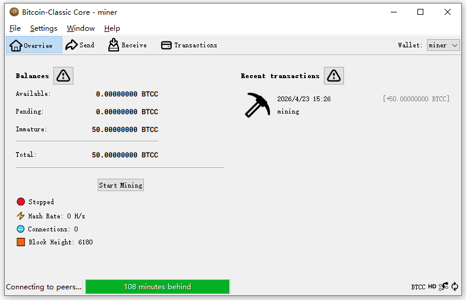

---

  
  

  

 

## Project Vision

Today, almost everyone has heard of Bitcoin, 
but very few people have actually obtained Bitcoin through mining.

Bitcoin-Classic aims to restore this original experience, 
allowing everyone to participate in mining and enjoy the fun and sense of achievement it brings.

This is not just a blockchain, but an attempt to return to the essence of Bitcoin.

---

## Project Overview

**Bitcoin-Classic (BTCC)** is a decentralized digital currency rebuilt based on Bitcoin Core v28.1.

---

## Project Goals

- Allow ordinary users to participate in mining  
- Lower the barrier to entry (CPU mining supported)  
- Recreate the “early Bitcoin” experience  
- Provide a lightweight and intuitive graphical interface  

---

## Consensus Mechanism

| Item | Description |
|------|------------|
| Consensus Algorithm | SHA-256 Proof-of-Work (PoW) |
| Algorithm Origin | Same as SHA-256 |
| Mining Method | CPU / GPU (low difficulty friendly) |
| Security Model | Longest chain rule |

---

## Block & Time Parameters

| Parameter | Value |
|----------|------|
| Block Time | 10 minutes / block |
| Difficulty Adjustment | 2016 blocks |
| Adjustment Period | ~14 days |
| Target Mechanism | Maintain stable block generation |

---

## Core Features

- Decentralization  
- Tamper resistance  
- Trustless system  

| Item | Value |
|------|------|
| Total Supply | 21,000,000 BTCC |
| Smallest Unit | 0.00000001 (1 BTCC = 100,000,000 units) |
| Initial Block Reward | 50 BTCC / block |
| Issuance Method | Mining |

---

## Halving Mechanism

| Parameter | Value |
|----------|------|
| Halving Interval | 210,000 blocks |
| Halving Period | ~4 years |
| Reward Schedule | 50 → 25 → 12.5 → ... |

---

## Example

| Block Height | Block Reward |
|-------------|-------------|
| 0 ~ 209,999 | 50 BTCC |
| 210,000 | 25 BTCC |
| 420,000 | 12.5 BTCC |

---

## Built-in Miner
  
- No additional configuration required  

- Click here to download Bitcoin Classic:  [Bitcoin-Classic-Setup.exe](https://github.com/Marcus-Vane/Bitcoin-Classic/releases/download/v1.0.0/Bitcoin-Classic-Setup.exe) Note: All source code is fully open source and publicly available for inspection.

- BTCC Blockchain Explorer：https://explorer.bitcoin-classic.net/

- Instructions

Download Bitcoin-Classic-Setup.exe and install it directly (it is recommended to install it on drive D or E). 
After installation, a desktop shortcut will be created. Double-click to run it.
When the program is launched for the first time, it will synchronize blockchain data. A
fter synchronization is complete, click “Create a new wallet”, then click “Start Mining”. 
After mining starts, a miner wallet will be created automatically. In the upper-right corner of the program, s
witch to the miner wallet to view the BTCC obtained from mining.

- Note: Please back up and properly keep your wallet at all times (the backup file is xxx.dat). 
Do not disclose your .dat file online or send it to anyone. 
The .dat file is equivalent to your private key and is the only proof of ownership of your wallet assets.

---

This is a new beginning.
