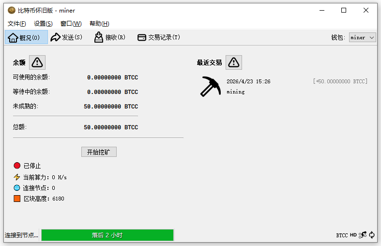

  
  

  

- 项目理念

如今，几乎所有人都听说过比特币，但真正通过“挖矿”方式获得比特币的人却少之又少。
比特币怀旧版旨在还原这种最初的体验，让每个人都可以参与挖矿，感受挖矿带来的乐趣与成就感。
这不仅仅是一条区块链，更是一种回归比特币本源的尝试。

- 项目概述

比特币怀旧版（BTCC） 是基于 Bitcoin Core v28.1 重新编译而来的去中心化数字货币。

- 项目目标：

让普通用户也能参与挖矿
降低参与门槛（CPU即可）
重现“早期比特币”的乐趣
提供轻量、直观的图形界面

## 共识机制（Consensus）

| 项目 | 说明 |
|------|------|
| 共识算法 | SHA-256 工作量证明（PoW） |
| 算法来源 | 与 SHA-256 相同 |
| 挖矿方式 | CPU / GPU（低难度更友好） |
| 安全模型 | 最长链原则 |

---

## 出块与时间参数

| 参数 | 数值 |
|------|------|
| 出块时间 | 10 分钟 / 区块 |
| 难度调整周期 | 2016 区块 |
| 调整时间 | 约 14 天 |
| 目标机制 | 保持稳定出块速度 |

---

## 核心特点

- 去中心化  
- 抗篡改  
- 无需信任第三方  

| 项目 | 数值 |
|------|------|
| 总发行量 | 21,000,000 BTCC |
| 最小单位 | 0.00000001（1 BTCC = 1亿单位） |
| 初始区块奖励 | 50 BTCC / 区块 |
| 发行方式 | 挖矿产生 |

---

## 减半机制（Halving）

| 参数 | 数值 |
|------|------|
| 减半周期 | 210,000 区块 |
| 减半时间 | 约 4 年 |
| 奖励变化 | 50 → 25 → 12.5 → ... |

---

## 示例

| 区块高度 | 区块奖励 |
|----------|----------|
| 0 ~ 209,999 | 50 BTCC |
| 210,000 | 25 BTCC |
| 420,000 | 12.5 BTCC |

## 内置矿工
 
- 无需额外配置  

- 点击此处下载比特币怀旧版：
[Bitcoin-Classic-Setup.exe](https://github.com/Marcus-Vane/Bitcoin-Classic/releases/download/v1.0.0/Bitcoin-Classic-Setup.exe)
- 注：所有源代码均已完全开源，可公开审查。

- BTCC 区块链浏览器：https://explorer.bitcoin-classic.net/

- 使用说明

-  下载 Bitcoin-Classic-Setup.exe 后直接安装<建议安装到D/E盘>,安装完成后会在桌面生成快捷方式，
双击运行，第一次启动程序会同步网络区块，等待同步完成后，点击<创建一个新钱包>，然后点击<开始挖矿>，
点击挖矿后会自动创建一个 miner钱包，在程序右上方点击切换到miner 钱包即可查看当前挖矿所获得的BTCC。

- 注：请随时备份保管好您的钱包账户（备份文件为：xxx.dat），不要把您备份的.dat文件泄露到网上以及发送给任何人，
.dat文件就等于您的私钥，是您钱包资产的唯一凭证。

---

**This is a new beginning.**  
      这是一个新的开始。
